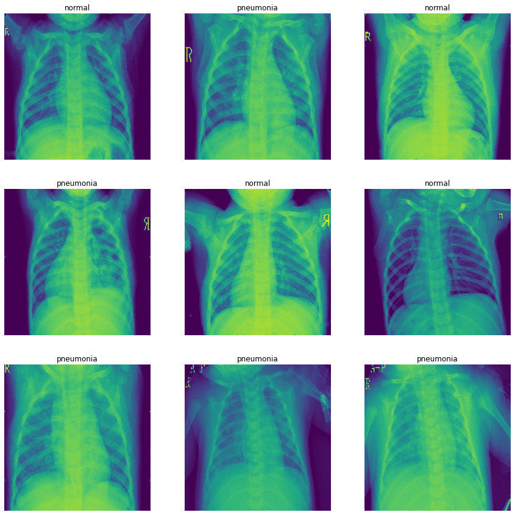
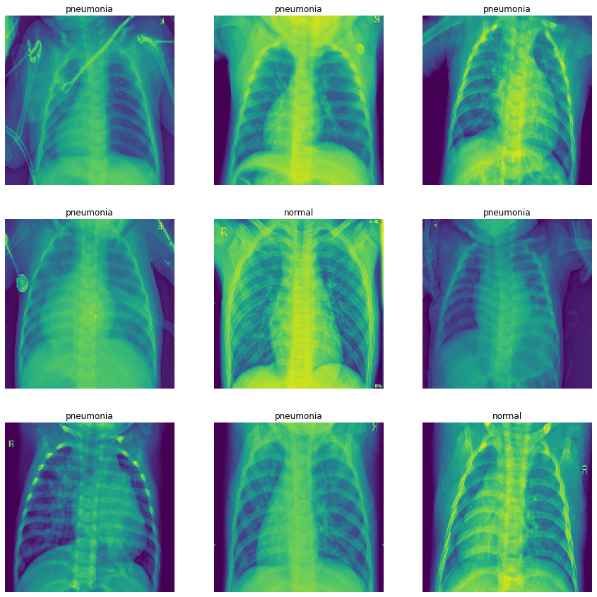
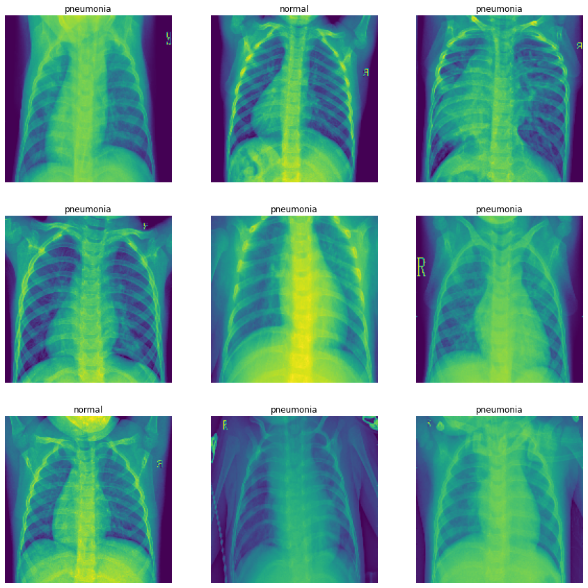
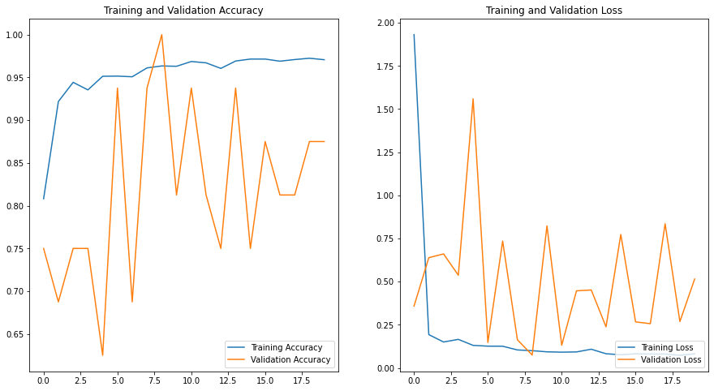
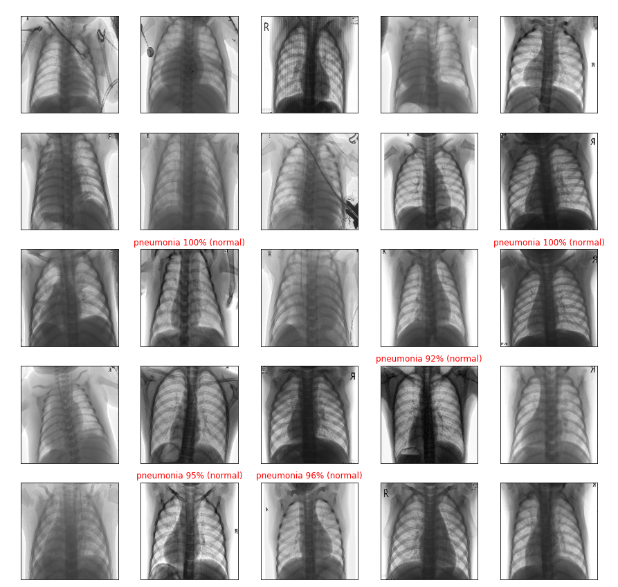

```python

import matplotlib.pyplot as plt
import numpy as np
import os
import random
import tensorflow as tf

# os.environ['TF_CPP_MIN_LOG_LEVEL'] = '2'
print(tf.__version__)

```

    2.9.1
    


```python
dataset_dir = os.path.join(os.getcwd(), 'chest_xray')

dataset_train_dir = os.path.join(dataset_dir, 'train')
dataset_train_normal_len = len(os.listdir(
    os.path.join(dataset_train_dir, 'NORMAL')))
dataset_train_pneumonia_len = len(os.listdir(
    os.path.join(dataset_train_dir, 'PNEUMONIA')))

dataset_test_dir = os.path.join(dataset_dir, 'test')
dataset_test_normal_len = len(os.listdir(
    os.path.join(dataset_test_dir, 'NORMAL')))
dataset_test_pneumonia_len = len(os.listdir(
    os.path.join(dataset_test_dir, 'PNEUMONIA')))

dataset_val_dir = os.path.join(dataset_dir, 'val')
dataset_val_normal_len = len(os.listdir(
    os.path.join(dataset_val_dir, 'NORMAL')))
dataset_val_pneumonia_len = len(os.listdir(
    os.path.join(dataset_val_dir, 'PNEUMONIA')))
```


```python
print('Training Normal: %s' % dataset_train_normal_len)
print('Training Pneumonia: %s' % dataset_train_pneumonia_len)
print('Test Normal: %s' % dataset_test_normal_len)
print('Test Pneumonia: %s' % dataset_test_pneumonia_len)
print('Validation Normal: %s' % dataset_val_normal_len)
print('Validation Pneumonia: %s' % dataset_val_pneumonia_len)
```

    Training Normal: 1342
    Training Pneumonia: 3876
    Test Normal: 234
    Test Pneumonia: 390
    Validation Normal: 9
    Validation Pneumonia: 9
    


```python
image_width = 160
image_height = 160


image_color_channel = 1
image_color_channel_size = 3
image_size = (image_width, image_height)
image_shape = image_size + (image_color_channel, )


batch_size = 32
epochs = 20
learning_rate = 0.001

class_names = ['normal', 'pneumonia']
```


```python
dataset_train = tf.keras.preprocessing.image_dataset_from_directory(
    dataset_train_dir,
    image_size = image_size,
    batch_size = batch_size,
    shuffle = True,
)
```

    Found 5216 files belonging to 2 classes.
    


```python
dataset_validation = tf.keras.preprocessing.image_dataset_from_directory(
    dataset_val_dir,
    image_size=image_size,
    batch_size=batch_size,
    shuffle=True
)
```

    Found 16 files belonging to 2 classes.
    


```python
dataset_test = tf.keras.preprocessing.image_dataset_from_directory(
    dataset_test_dir,
    image_size=image_size,
    batch_size=batch_size,
    shuffle=True
)
```

    Found 624 files belonging to 2 classes.
    


```python
# resize the images to a common size
def preprocess_image(image, label):
    image = tf.image.resize(image, image_size)
    image = tf.image.random_flip_left_right(image)
    
    # greyscale the image
    image = tf.image.rgb_to_grayscale(image)
    # image = tf.image.random_brightness(image, max_delta=0.1)
    # image = tf.image.random_contrast(image, lower=0.9, upper=1.1)
    return image, label
  
dataset_train = dataset_train.map(preprocess_image)
dataset_test = dataset_test.map(preprocess_image)
dataset_validation = dataset_validation.map(preprocess_image)


```


```python
 
def plot_dataset(dataset):
    plt.gcf().clear()
    plt.figure(figsize=(15, 15))

    for features, labels in dataset.take(1):
        for i in range(9):
            plt.subplot(3, 3, i + 1)
            plt.axis('off')

            plt.imshow(features[i].numpy().astype('uint8'))
            plt.title(class_names[labels[i]])
```


```python
plot_dataset(dataset_validation)
```


    <Figure size 432x288 with 0 Axes>


    

    


```python
plot_dataset(dataset_test)
```


    <Figure size 432x288 with 0 Axes>


    

    


```python
plot_dataset(dataset_train)
```


    <Figure size 432x288 with 0 Axes>


    

    


```python
data_augmentation = tf.keras.Sequential([
  tf.keras.layers.experimental.preprocessing.RandomFlip('horizontal'),
  # tf.keras.layers.experimental.preprocessing.RandomRotation(0.2),
  tf.keras.layers.experimental.preprocessing.RandomZoom(0.2),
])
```


```python
def plot_dataset_data_augmentation(dataset):
  plt.gcf().clear()
  plt.figure(figsize=(15, 15))
  
  for features, _ in dataset.take(1):
    feature = features[0]
    
    for i in range(9):
      feature_data_augmentation = data_augmentation(tf.expand_dims(feature, 0))
      
      plt.subplot(3, 3, i + 1)
      plt.axis('off')
      
      plt.imshow(feature_data_augmentation[0]  / image_color_channel_size)
```


```python
model = tf.keras.models.Sequential([
    tf.keras.layers.experimental.preprocessing.Rescaling(
        1. / image_color_channel_size,
        input_shape=image_shape
    ),
    data_augmentation,
    tf.keras.layers.Conv2D(32, 3, padding='same', activation='relu'),
    tf.keras.layers.MaxPooling2D(),
    tf.keras.layers.Conv2D(64, 3, padding='same', activation='relu'),
    tf.keras.layers.MaxPooling2D(),
    tf.keras.layers.Conv2D(128, 3, padding='same', activation='relu'),
    tf.keras.layers.MaxPooling2D(),
    tf.keras.layers.Conv2D(256, 3, padding='same', activation='relu'),
    tf.keras.layers.MaxPooling2D(),
    tf.keras.layers.Flatten(),
    tf.keras.layers.Dense(512, activation='relu'),
    tf.keras.layers.Dense(2, activation='softmax')
])

model.compile(optimizer='adam',
              loss='sparse_categorical_crossentropy',
              metrics=['accuracy'])

```


```python
model.summary()
```

    Model: "sequential_1"
    _________________________________________________________________
     Layer (type)                Output Shape              Param #   
    =================================================================
     rescaling (Rescaling)       (None, 160, 160, 1)       0         
                                                                     
     sequential (Sequential)     (None, 160, 160, 1)       0         
                                                                     
     conv2d (Conv2D)             (None, 160, 160, 32)      320       
                                                                     
     max_pooling2d (MaxPooling2D  (None, 80, 80, 32)       0         
     )                                                               
                                                                     
     conv2d_1 (Conv2D)           (None, 80, 80, 64)        18496     
                                                                     
     max_pooling2d_1 (MaxPooling  (None, 40, 40, 64)       0         
     2D)                                                             
                                                                     
     conv2d_2 (Conv2D)           (None, 40, 40, 128)       73856     
                                                                     
     max_pooling2d_2 (MaxPooling  (None, 20, 20, 128)      0         
     2D)                                                             
                                                                     
     conv2d_3 (Conv2D)           (None, 20, 20, 256)       295168    
                                                                     
     max_pooling2d_3 (MaxPooling  (None, 10, 10, 256)      0         
     2D)                                                             
                                                                     
     flatten (Flatten)           (None, 25600)             0         
                                                                     
     dense (Dense)               (None, 512)               13107712  
                                                                     
     dense_1 (Dense)             (None, 2)                 1026      
                                                                     
    =================================================================
    Total params: 13,496,578
    Trainable params: 13,496,578
    Non-trainable params: 0
    _________________________________________________________________
    


```python
history = model.fit(
  dataset_train,
  validation_data=dataset_validation,
  epochs=epochs,
)
```

    Epoch 1/20
    163/163 [==============================] - 17s 80ms/step - loss: 1.9313 - accuracy: 0.8081 - val_loss: 0.3583 - val_accuracy: 0.7500
    Epoch 2/20
    163/163 [==============================] - 14s 80ms/step - loss: 0.1933 - accuracy: 0.9218 - val_loss: 0.6389 - val_accuracy: 0.6875
    Epoch 3/20
    163/163 [==============================] - 13s 79ms/step - loss: 0.1505 - accuracy: 0.9442 - val_loss: 0.6608 - val_accuracy: 0.7500
    Epoch 4/20
    163/163 [==============================] - 14s 84ms/step - loss: 0.1657 - accuracy: 0.9354 - val_loss: 0.5373 - val_accuracy: 0.7500
    Epoch 5/20
    163/163 [==============================] - 14s 80ms/step - loss: 0.1309 - accuracy: 0.9513 - val_loss: 1.5595 - val_accuracy: 0.6250
    Epoch 6/20
    163/163 [==============================] - 14s 84ms/step - loss: 0.1264 - accuracy: 0.9515 - val_loss: 0.1479 - val_accuracy: 0.9375
    Epoch 7/20
    163/163 [==============================] - 15s 90ms/step - loss: 0.1260 - accuracy: 0.9507 - val_loss: 0.7353 - val_accuracy: 0.6875
    Epoch 8/20
    163/163 [==============================] - 14s 82ms/step - loss: 0.1044 - accuracy: 0.9611 - val_loss: 0.1632 - val_accuracy: 0.9375
    Epoch 9/20
    163/163 [==============================] - 15s 91ms/step - loss: 0.1002 - accuracy: 0.9634 - val_loss: 0.0749 - val_accuracy: 1.0000
    Epoch 10/20
    163/163 [==============================] - 14s 85ms/step - loss: 0.0935 - accuracy: 0.9630 - val_loss: 0.8234 - val_accuracy: 0.8125
    Epoch 11/20
    163/163 [==============================] - 14s 85ms/step - loss: 0.0916 - accuracy: 0.9686 - val_loss: 0.1317 - val_accuracy: 0.9375
    Epoch 12/20
    163/163 [==============================] - 14s 83ms/step - loss: 0.0929 - accuracy: 0.9670 - val_loss: 0.4470 - val_accuracy: 0.8125
    Epoch 13/20
    163/163 [==============================] - 14s 83ms/step - loss: 0.1086 - accuracy: 0.9605 - val_loss: 0.4518 - val_accuracy: 0.7500
    Epoch 14/20
    163/163 [==============================] - 14s 84ms/step - loss: 0.0824 - accuracy: 0.9691 - val_loss: 0.2382 - val_accuracy: 0.9375
    Epoch 15/20
    163/163 [==============================] - 14s 82ms/step - loss: 0.0765 - accuracy: 0.9714 - val_loss: 0.7732 - val_accuracy: 0.7500
    Epoch 16/20
    163/163 [==============================] - 14s 83ms/step - loss: 0.0820 - accuracy: 0.9714 - val_loss: 0.2670 - val_accuracy: 0.8750
    Epoch 17/20
    163/163 [==============================] - 14s 84ms/step - loss: 0.0806 - accuracy: 0.9689 - val_loss: 0.2566 - val_accuracy: 0.8125
    Epoch 18/20
    163/163 [==============================] - 14s 83ms/step - loss: 0.0810 - accuracy: 0.9709 - val_loss: 0.8356 - val_accuracy: 0.8125
    Epoch 19/20
    163/163 [==============================] - 14s 81ms/step - loss: 0.0732 - accuracy: 0.9724 - val_loss: 0.2686 - val_accuracy: 0.8750
    Epoch 20/20
    163/163 [==============================] - 14s 82ms/step - loss: 0.0822 - accuracy: 0.9707 - val_loss: 0.5154 - val_accuracy: 0.8750
    


```python
def plot_model():
  accuracy = history.history['accuracy']
  val_accuracy = history.history['val_accuracy']
  
  loss = history.history['loss']
  val_loss = history.history['val_loss']
  
  epochs_range = range(epochs)
  
  plt.gcf().clear()
  plt.figure(figsize=(15,8))
  
  plt.subplot(1,2,1)
  plt.title('Training and Validation Accuracy')
  plt.plot(epochs_range, accuracy, label='Training Accuracy')
  plt.plot(epochs_range, val_accuracy, label='Validation Accuracy')
  plt.legend(loc='lower right')
  
  plt.subplot(1,2,2)
  plt.title('Training and Validation Loss')
  plt.plot(epochs_range, loss, label='Training Loss')
  plt.plot(epochs_range, val_loss, label='Validation Loss')
  plt.legend(loc='lower right')
  
  plt.show()
```


```python
plot_model()
```


    <Figure size 432x288 with 0 Axes>


    

    


```python
def plot_image(i, predictions_array, true_label, img):
    predictions_array, true_label, img = predictions_array, true_label[i], img[i]
    plt.grid(False)
    plt.xticks([])
    plt.yticks([])

    plt.imshow(img.astype('uint8'), cmap=plt.cm.binary)

    predicted_label = np.argmax(predictions_array)
    if(predicted_label == true_label):
        color = 'white'
    else:
        color = 'red'

    plt.title("{} {:2.0f}% ({})".format(
        class_names[predicted_label],
        100*np.max(predictions_array),
        class_names[true_label]),
        color=color)


def plot_results(predictions, labels, images):
    plt.gcf().clear()
    plt.figure(figsize=(15, 15))

    # len of test_images
    len = predictions.shape[0]

    # random 25 different images
    arrayindex = random.sample(range(len), 25)

    for i in range(25):
        plt.subplot(5, 5, i+1)
        plot_image(arrayindex[i], predictions[arrayindex[i]], labels, images)
        

        

```


```python
features, labels = dataset_test.as_numpy_iterator().next()
predictions = model.predict(features)

plot_results(predictions, labels, features)
```

    1/1 [==============================] - 0s 80ms/step
    


    <Figure size 432x288 with 0 Axes>


    

    


```python
model.save('models/x_ray_v1.h5')
```


```python
model = tf.keras.models.load_model('models/x_ray_v1.h5')
```
